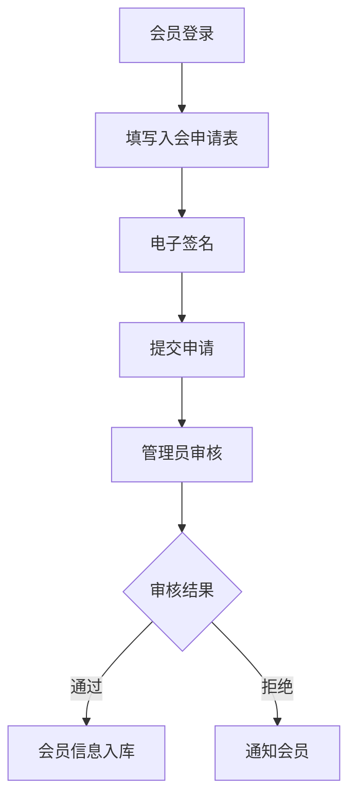
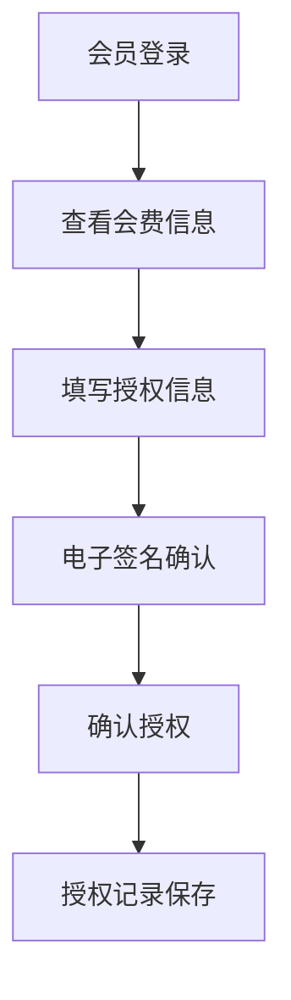
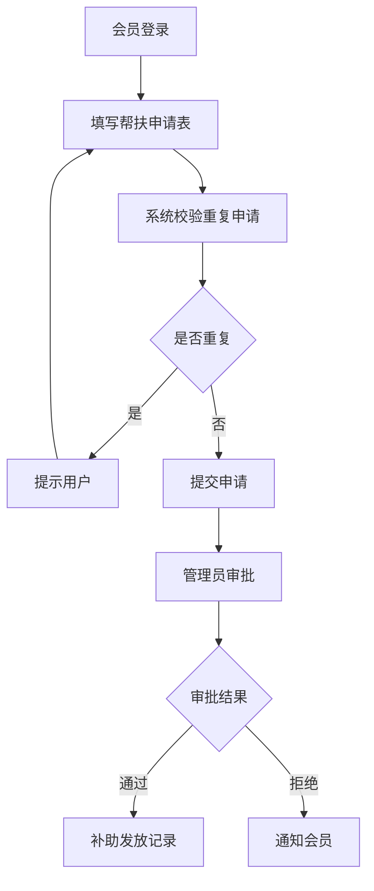

## 1. Product Overview
工会职工档案系统是一款面向工会组织的无纸化办公平台，旨在解决传统纸质入会申请、会费授权管理及困难职工帮扶等业务流程效率低下、难以管理的问题。通过电子化手段实现入会申请、会费授权、困难职工档案管理和统计分析的全流程线上化，提升工会工作效率和管理水平。

## 2. Core Features

### 2.1 User Roles
| Role | Registration Method | Core Permissions |
|------|---------------------|------------------|
| 普通会员 | 在线注册/管理员录入 | 填写入会申请、授权会费扣划、查看个人信息、申请困难帮扶 |
| 工会管理员 | 管理员后台创建 | 审核入会申请、管理会员信息、审批困难帮扶申请、查看统计报表 |

### 2.2 Feature Module
1. **入会申请模块**: 在线填写入会申请表，支持电子签名
2. **会费授权模块**: 在线授权会费扣划，电子签名确认
3. **困难职工档案模块**: 建立电子档案，记录帮扶申请，自动校验重复申请
4. **查询统计模块**: 多条件检索，生成统计报表
5. **系统管理模块**: 用户管理、权限配置、数据导出

### 2.3 Page Details
| Page Name | Module Name | Feature description |
|-----------|-------------|---------------------|
| 首页 | Dashboard | 系统概览、待办事项、快捷入口 |
| 入会申请 | 入会申请 | 填写入会申请表单、电子签名、提交申请 |
| 入会审核 | 入会审核 | 查看申请列表、审核通过/拒绝 |
| 会费授权 | 会费授权 | 填写授权信息、电子签名、确认授权 |
| 困难帮扶申请 | 困难帮扶 | 填写病种、金额等信息，系统自动校验重复申请 |
| 困难职工档案 | 档案管理 | 查看困难职工档案列表、详情、历史申请记录 |
| 查询统计 | 查询统计 | 多条件检索、统计报表生成 |
| 用户管理 | 系统管理 | 用户列表、权限配置、数据导出 |

## 3. Core Process

### 3.1 入会申请流程
会员登录系统 → 填写入会申请表单 → 电子签名 → 提交申请 → 管理员审核 → 审核通过/拒绝

### 3.2 会费授权流程
会员登录系统 → 查看会费信息 → 填写授权信息 → 电子签名 → 确认授权 → 授权记录保存

### 3.3 困难帮扶申请流程
会员登录系统 → 填写帮扶申请表 → 系统自动校验重复申请 → 提交申请 → 管理员审批 → 审批通过/拒绝

## 4. User Interface Design

### 4.1 Design Style
- **主色调**: 蓝色(#1E40AF)作为主色，象征工会组织的稳重与信任
- **辅助色**: 橙色(#F97316)作为强调色，用于按钮和重要操作
- **按钮样式**: 圆角矩形，悬停时有阴影效果，主按钮使用渐变背景
- **字体**: 中文使用"思源黑体"，英文使用"Roboto"
- **布局风格**: 卡片式布局，清晰的信息层级
- **图标风格**: 使用Lucide图标库，统一的线条风格

### 4.2 Page Design Overview
| Page Name | Module Name | UI Elements |
|-----------|-------------|-------------|
| 首页 | Dashboard | 统计卡片、待办事项列表、快捷入口按钮、数据图表 |
| 入会申请 | 入会申请 | 表单输入框、电子签名画布、提交按钮、表单验证提示 |
| 会费授权 | 会费授权 | 授权信息展示、电子签名区域、确认按钮、授权记录列表 |
| 困难帮扶申请 | 困难帮扶 | 病种选择器、金额输入、申请理由、重复申请提示 |
| 困难职工档案 | 档案管理 | 档案卡片列表、搜索筛选、详情弹窗、历史记录表格 |
| 查询统计 | 查询统计 | 筛选条件区域、结果表格、统计图表、导出按钮 |

### 4.3 Responsiveness
- **桌面端**: 完整功能展示，多栏布局
- **平板端**: 响应式调整，保持主要功能完整
- **移动端**: 单列布局，简化操作流程，优化触控体验

### 4.4 Accessibility
- 支持键盘导航
- 确保颜色对比度符合WCAG标准
- 提供清晰的表单验证提示
- 使用语义化HTML标签
