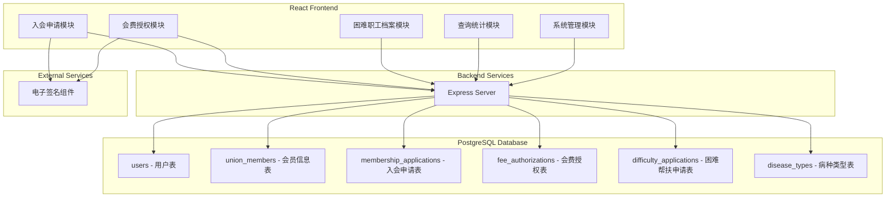
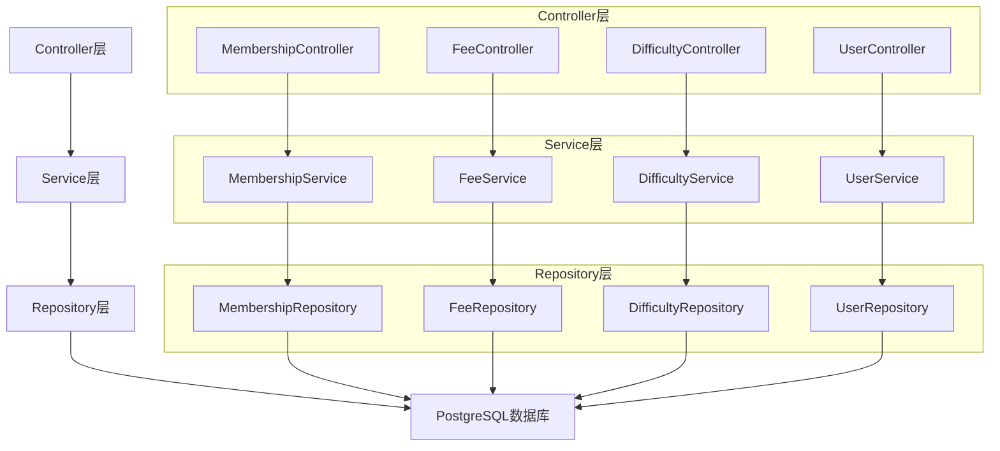
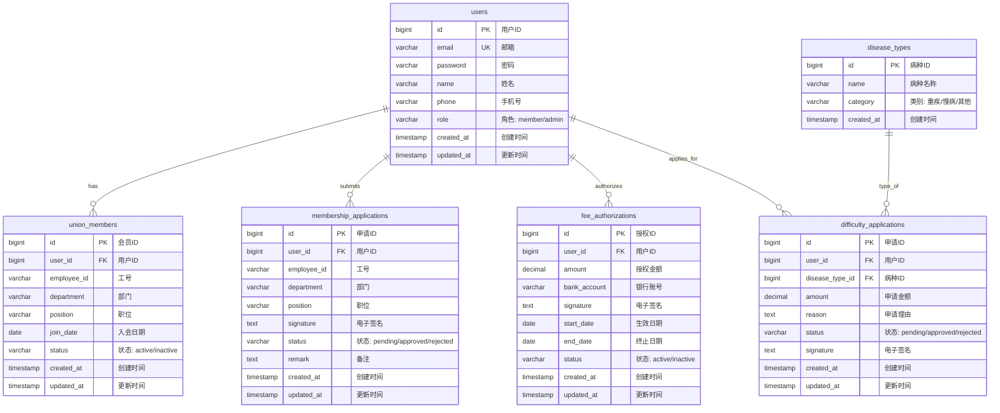

## 1. Architecture Design



## 2. Technology Description
- **Frontend**: React@18 + TypeScript + TailwindCSS@3 + Vite
- **Backend**: Express@4 + TypeScript
- **Database**: PostgreSQL
- **State Management**: Zustand
- **Routing**: React Router DOM
- **Icons**: Lucide React
- **Charting**: Chart.js + react-chartjs-2
- **Date Handling**: date-fns

## 3. Route Definitions
| Route | Purpose |
|-------|---------|
| / | 首页 Dashboard |
| /membership/apply | 入会申请页面 |
| /membership/audit | 入会审核页面（管理员） |
| /fee/authorization | 会费授权页面 |
| /difficulty/apply | 困难帮扶申请页面 |
| /difficulty/records | 困难职工档案页面 |
| /statistics | 查询统计页面 |
| /admin/users | 用户管理页面（管理员） |

## 4. API Definitions

### 4.1 入会申请 API
| Method | Endpoint | Description |
|--------|----------|-------------|
| POST | /api/membership/apply | 提交入会申请 |
| GET | /api/membership/applications | 获取申请列表 |
| PUT | /api/membership/applications/:id | 审核申请 |
| GET | /api/membership/applications/:id | 获取申请详情 |

### 4.2 会费授权 API
| Method | Endpoint | Description |
|--------|----------|-------------|
| POST | /api/fee/authorize | 提交会费授权 |
| GET | /api/fee/authorizations | 获取授权列表 |
| GET | /api/fee/authorizations/:id | 获取授权详情 |

### 4.3 困难帮扶 API
| Method | Endpoint | Description |
|--------|----------|-------------|
| POST | /api/difficulty/apply | 提交困难帮扶申请 |
| GET | /api/difficulty/applications | 获取帮扶申请列表 |
| PUT | /api/difficulty/applications/:id | 审批帮扶申请 |
| GET | /api/difficulty/records | 获取困难职工档案 |
| GET | /api/difficulty/check-duplicate | 检查重复申请 |

### 4.4 用户管理 API
| Method | Endpoint | Description |
|--------|----------|-------------|
| GET | /api/users | 获取用户列表 |
| POST | /api/users | 创建用户 |
| PUT | /api/users/:id | 更新用户信息 |
| DELETE | /api/users/:id | 删除用户 |

## 5. Server Architecture Diagram



## 6. Data Model

### 6.1 Data Model Definition



### 6.2 Data Definition Language

```sql
CREATE TABLE users (
    id BIGSERIAL PRIMARY KEY,
    email VARCHAR(255) UNIQUE NOT NULL,
    password VARCHAR(255) NOT NULL,
    name VARCHAR(100) NOT NULL,
    phone VARCHAR(20),
    role VARCHAR(20) DEFAULT 'member' CHECK (role IN ('member', 'admin')),
    created_at TIMESTAMP DEFAULT CURRENT_TIMESTAMP,
    updated_at TIMESTAMP DEFAULT CURRENT_TIMESTAMP
);

CREATE TABLE union_members (
    id BIGSERIAL PRIMARY KEY,
    user_id BIGINT REFERENCES users(id) UNIQUE NOT NULL,
    employee_id VARCHAR(50),
    department VARCHAR(100),
    position VARCHAR(100),
    join_date DATE,
    status VARCHAR(20) DEFAULT 'active' CHECK (status IN ('active', 'inactive')),
    created_at TIMESTAMP DEFAULT CURRENT_TIMESTAMP,
    updated_at TIMESTAMP DEFAULT CURRENT_TIMESTAMP
);

CREATE TABLE membership_applications (
    id BIGSERIAL PRIMARY KEY,
    user_id BIGINT REFERENCES users(id) NOT NULL,
    employee_id VARCHAR(50),
    department VARCHAR(100),
    position VARCHAR(100),
    signature TEXT,
    status VARCHAR(20) DEFAULT 'pending' CHECK (status IN ('pending', 'approved', 'rejected')),
    remark TEXT,
    created_at TIMESTAMP DEFAULT CURRENT_TIMESTAMP,
    updated_at TIMESTAMP DEFAULT CURRENT_TIMESTAMP
);

CREATE TABLE fee_authorizations (
    id BIGSERIAL PRIMARY KEY,
    user_id BIGINT REFERENCES users(id) NOT NULL,
    amount DECIMAL(10, 2) NOT NULL,
    bank_account VARCHAR(50),
    signature TEXT,
    start_date DATE NOT NULL,
    end_date DATE,
    status VARCHAR(20) DEFAULT 'active' CHECK (status IN ('active', 'inactive')),
    created_at TIMESTAMP DEFAULT CURRENT_TIMESTAMP,
    updated_at TIMESTAMP DEFAULT CURRENT_TIMESTAMP
);

CREATE TABLE disease_types (
    id BIGSERIAL PRIMARY KEY,
    name VARCHAR(100) NOT NULL,
    category VARCHAR(20) CHECK (category IN ('重疾', '慢病', '其他')),
    created_at TIMESTAMP DEFAULT CURRENT_TIMESTAMP
);

CREATE TABLE difficulty_applications (
    id BIGSERIAL PRIMARY KEY,
    user_id BIGINT REFERENCES users(id) NOT NULL,
    disease_type_id BIGINT REFERENCES disease_types(id) NOT NULL,
    amount DECIMAL(10, 2) NOT NULL,
    reason TEXT,
    status VARCHAR(20) DEFAULT 'pending' CHECK (status IN ('pending', 'approved', 'rejected')),
    signature TEXT,
    created_at TIMESTAMP DEFAULT CURRENT_TIMESTAMP,
    updated_at TIMESTAMP DEFAULT CURRENT_TIMESTAMP
);

INSERT INTO disease_types (name, category) VALUES
('恶性肿瘤', '重疾'),
('严重心血管疾病', '重疾'),
('慢性肾功能衰竭', '重疾'),
('严重肝病', '重疾'),
('糖尿病', '慢病'),
('高血压', '慢病'),
('心脏病', '慢病'),
('其他疾病', '其他');

INSERT INTO users (email, password, name, phone, role) VALUES
('admin@union.com', '$2b$10$N9qo8uLOickgx2ZMRZoMye.IjzqAKL9xL5jvMFVdNJHvGCgTq/VEq', '系统管理员', '13800138000', 'admin');
```
